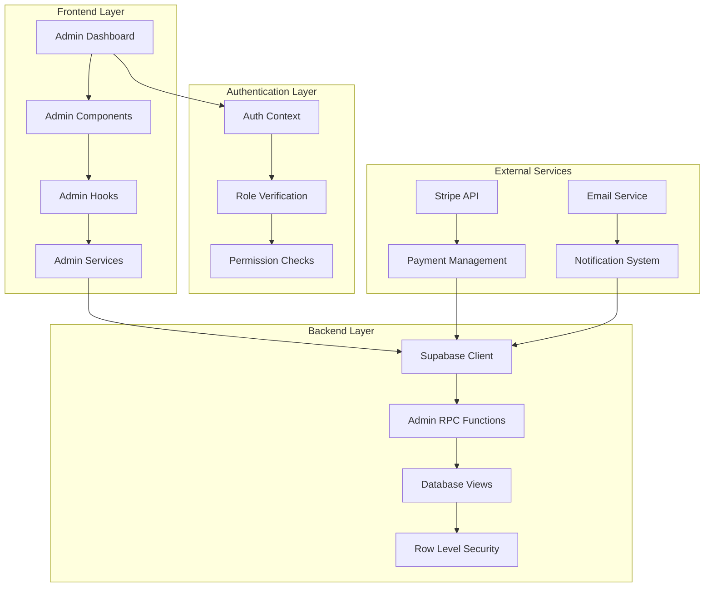

# Design Document

## Overview

The admin space integration will provide a comprehensive, secure, and scalable administrative interface for the Loventy platform. The design leverages the existing authentication system with role-based access control (RBAC) and extends the current dashboard architecture to include specialized admin functionality.

The admin space will be built as a modular system within the existing React/TypeScript architecture, utilizing Supabase for backend operations, and maintaining consistency with the current design system and user experience patterns.

## Architecture

### High-Level Architecture



### Security Architecture

The admin space will implement multiple layers of security:

1. **Authentication Layer**: Multi-factor authentication for admin users
2. **Authorization Layer**: Role-based access control with granular permissions
3. **Data Layer**: Row-level security policies in Supabase
4. **Audit Layer**: Comprehensive logging of all admin actions
5. **Session Management**: Enhanced session security with shorter timeouts

### Integration Points

- **Existing Auth System**: Extends current AuthContext with admin-specific functionality
- **Dashboard Layout**: Integrates seamlessly with existing DashboardLayout
- **Database Schema**: Utilizes existing RBAC tables and extends with admin-specific views
- **Stripe Integration**: Leverages existing Stripe setup for financial management
- **Component Library**: Maintains consistency with existing UI components

## Components and Interfaces

### Core Admin Components

#### 1. AdminDashboard Component
```typescript
interface AdminDashboardProps {
  children: React.ReactNode;
}

interface AdminStats {
  totalUsers: number;
  activeUsers: number;
  totalEvents: number;
  monthlyRevenue: number;
  systemHealth: 'healthy' | 'warning' | 'critical';
}
```

#### 2. UserManagement Component
```typescript
interface UserManagementProps {
  searchQuery?: string;
  filterStatus?: 'all' | 'active' | 'suspended' | 'pending';
}

interface UserListItem {
  id: string;
  email: string;
  name: string;
  status: 'active' | 'suspended' | 'pending';
  subscriptionType: 'free' | 'premium';
  lastLogin: Date;
  eventsCount: number;
  joinDate: Date;
}
```

#### 3. EventOversight Component
```typescript
interface EventOversightProps {
  dateRange?: { start: Date; end: Date };
  statusFilter?: 'all' | 'active' | 'completed' | 'flagged';
}

interface EventListItem {
  id: string;
  title: string;
  ownerName: string;
  ownerEmail: string;
  eventDate: Date;
  guestCount: number;
  status: 'active' | 'completed' | 'flagged';
  flagReason?: string;
  createdAt: Date;
}
```

#### 4. SystemHealth Component
```typescript
interface SystemHealthProps {
  refreshInterval?: number;
}

interface HealthMetrics {
  apiResponseTime: number;
  databaseConnections: number;
  errorRate: number;
  uptime: number;
  memoryUsage: number;
  activeUsers: number;
}
```

#### 5. FinancialDashboard Component
```typescript
interface FinancialDashboardProps {
  period: 'day' | 'week' | 'month' | 'year';
}

interface FinancialMetrics {
  totalRevenue: number;
  subscriptionRevenue: number;
  oneTimePayments: number;
  refunds: number;
  churnRate: number;
  conversionRate: number;
}
```

### Admin-Specific Hooks

#### 1. useAdminStats Hook
```typescript
interface AdminStatsHook {
  stats: AdminStats | null;
  loading: boolean;
  error: string | null;
  refresh: () => Promise<void>;
}
```

#### 2. useUserManagement Hook
```typescript
interface UserManagementHook {
  users: UserListItem[];
  loading: boolean;
  error: string | null;
  searchUsers: (query: string) => Promise<void>;
  suspendUser: (userId: string, reason: string) => Promise<void>;
  reactivateUser: (userId: string) => Promise<void>;
  getUserDetails: (userId: string) => Promise<UserDetails>;
}
```

#### 3. useSystemHealth Hook
```typescript
interface SystemHealthHook {
  metrics: HealthMetrics | null;
  alerts: SystemAlert[];
  loading: boolean;
  error: string | null;
  refreshMetrics: () => Promise<void>;
}
```

### Database Extensions

#### Admin Views
```sql
-- Admin user overview
CREATE VIEW admin_user_overview AS
SELECT 
  u.id,
  u.email,
  u.first_name,
  u.last_name,
  u.created_at,
  u.updated_at,
  COUNT(DISTINCT i.id) as events_count,
  COUNT(DISTINCT g.id) as guests_count,
  s.status as subscription_status,
  s.current_period_end
FROM users u
LEFT JOIN invitations i ON u.id = i.user_id
LEFT JOIN guests g ON u.id = g.user_id
LEFT JOIN stripe_subscriptions s ON u.id = s.customer_id
GROUP BY u.id, s.status, s.current_period_end;

-- System health metrics
CREATE VIEW admin_system_metrics AS
SELECT 
  COUNT(DISTINCT u.id) as total_users,
  COUNT(DISTINCT CASE WHEN u.updated_at > NOW() - INTERVAL '30 days' THEN u.id END) as active_users,
  COUNT(DISTINCT i.id) as total_events,
  COUNT(DISTINCT g.id) as total_guests,
  AVG(i.view_count) as avg_event_views
FROM users u
LEFT JOIN invitations i ON u.id = i.user_id
LEFT JOIN guests g ON u.id = g.user_id;
```

#### Admin RPC Functions
```sql
-- Get user activity details
CREATE OR REPLACE FUNCTION get_user_activity(user_uuid UUID)
RETURNS TABLE (
  activity_type TEXT,
  activity_date TIMESTAMP,
  details JSONB
) AS $$
BEGIN
  RETURN QUERY
  SELECT 
    'event_created'::TEXT,
    i.created_at,
    jsonb_build_object('event_title', i.title, 'event_id', i.id)
  FROM invitations i
  WHERE i.user_id = user_uuid
  UNION ALL
  SELECT 
    'guest_added'::TEXT,
    g.created_at,
    jsonb_build_object('guest_name', g.name, 'event_id', g.invitation_id)
  FROM guests g
  WHERE g.user_id = user_uuid
  ORDER BY activity_date DESC;
END;
$$ LANGUAGE plpgsql SECURITY DEFINER;

-- Admin user suspension
CREATE OR REPLACE FUNCTION admin_suspend_user(
  user_uuid UUID,
  admin_uuid UUID,
  suspension_reason TEXT
)
RETURNS BOOLEAN AS $$
BEGIN
  -- Insert suspension record
  INSERT INTO user_suspensions (user_id, suspended_by, reason, suspended_at)
  VALUES (user_uuid, admin_uuid, suspension_reason, NOW());
  
  -- Update user status
  UPDATE users 
  SET status = 'suspended', updated_at = NOW()
  WHERE id = user_uuid;
  
  RETURN TRUE;
END;
$$ LANGUAGE plpgsql SECURITY DEFINER;
```

## Data Models

### Admin-Specific Tables

#### 1. Admin Audit Log
```sql
CREATE TABLE admin_audit_log (
  id UUID PRIMARY KEY DEFAULT gen_random_uuid(),
  admin_id UUID REFERENCES users(id),
  action_type VARCHAR(50) NOT NULL,
  resource_type VARCHAR(50) NOT NULL,
  resource_id UUID,
  old_values JSONB,
  new_values JSONB,
  ip_address INET,
  user_agent TEXT,
  created_at TIMESTAMP DEFAULT NOW()
);
```

#### 2. System Alerts
```sql
CREATE TABLE system_alerts (
  id UUID PRIMARY KEY DEFAULT gen_random_uuid(),
  alert_type VARCHAR(50) NOT NULL,
  severity VARCHAR(20) NOT NULL CHECK (severity IN ('low', 'medium', 'high', 'critical')),
  title VARCHAR(255) NOT NULL,
  description TEXT,
  metadata JSONB,
  is_resolved BOOLEAN DEFAULT FALSE,
  resolved_by UUID REFERENCES users(id),
  resolved_at TIMESTAMP,
  created_at TIMESTAMP DEFAULT NOW()
);
```

#### 3. User Suspensions
```sql
CREATE TABLE user_suspensions (
  id UUID PRIMARY KEY DEFAULT gen_random_uuid(),
  user_id UUID REFERENCES users(id),
  suspended_by UUID REFERENCES users(id),
  reason TEXT NOT NULL,
  suspended_at TIMESTAMP DEFAULT NOW(),
  lifted_at TIMESTAMP,
  lifted_by UUID REFERENCES users(id),
  is_active BOOLEAN DEFAULT TRUE
);
```

#### 4. Content Moderation
```sql
CREATE TABLE content_moderation (
  id UUID PRIMARY KEY DEFAULT gen_random_uuid(),
  content_type VARCHAR(50) NOT NULL,
  content_id UUID NOT NULL,
  reported_by UUID REFERENCES users(id),
  reviewed_by UUID REFERENCES users(id),
  status VARCHAR(20) DEFAULT 'pending' CHECK (status IN ('pending', 'approved', 'rejected', 'flagged')),
  moderation_reason TEXT,
  automated_flags JSONB,
  reviewed_at TIMESTAMP,
  created_at TIMESTAMP DEFAULT NOW()
);
```

### Extended User Model
```typescript
interface AdminUserDetails extends User {
  status: 'active' | 'suspended' | 'pending';
  suspensionReason?: string;
  lastLoginAt?: Date;
  eventsCount: number;
  guestsCount: number;
  subscriptionStatus: 'free' | 'premium' | 'cancelled';
  subscriptionEndDate?: Date;
  totalRevenue: number;
  accountFlags: string[];
}
```

## Error Handling

### Admin-Specific Error Types
```typescript
enum AdminErrorType {
  INSUFFICIENT_PERMISSIONS = 'INSUFFICIENT_PERMISSIONS',
  USER_NOT_FOUND = 'USER_NOT_FOUND',
  SYSTEM_MAINTENANCE = 'SYSTEM_MAINTENANCE',
  AUDIT_LOG_FAILURE = 'AUDIT_LOG_FAILURE',
  EXTERNAL_SERVICE_ERROR = 'EXTERNAL_SERVICE_ERROR'
}

interface AdminError {
  type: AdminErrorType;
  message: string;
  details?: any;
  timestamp: Date;
  adminId: string;
  action: string;
}
```

### Error Handling Strategy
1. **Graceful Degradation**: Admin functions continue to work even if non-critical services fail
2. **Comprehensive Logging**: All errors are logged with full context for debugging
3. **User Feedback**: Clear, actionable error messages for admin users
4. **Automatic Recovery**: Self-healing mechanisms for common issues
5. **Escalation Paths**: Critical errors trigger immediate notifications

### Error Boundaries
```typescript
interface AdminErrorBoundaryState {
  hasError: boolean;
  error?: AdminError;
  errorInfo?: any;
}

class AdminErrorBoundary extends React.Component<
  { children: React.ReactNode },
  AdminErrorBoundaryState
> {
  // Implementation with admin-specific error handling
}
```

## Testing Strategy

### Unit Testing
- **Component Testing**: All admin components with comprehensive test coverage
- **Hook Testing**: Custom admin hooks with mock data and error scenarios
- **Service Testing**: Admin service functions with various input scenarios
- **Utility Testing**: Helper functions and data transformations

### Integration Testing
- **Authentication Flow**: Admin login with MFA and role verification
- **Database Operations**: CRUD operations with proper permissions
- **External Services**: Stripe API integration and email services
- **Error Scenarios**: Network failures and service unavailability

### End-to-End Testing
- **Admin Workflows**: Complete user management and system monitoring flows
- **Security Testing**: Permission boundaries and unauthorized access attempts
- **Performance Testing**: Large dataset handling and response times
- **Cross-browser Testing**: Compatibility across different browsers

### Security Testing
- **Penetration Testing**: Simulated attacks on admin endpoints
- **Access Control Testing**: Verification of role and permission boundaries
- **Data Protection Testing**: Sensitive data handling and encryption
- **Audit Trail Testing**: Completeness and integrity of audit logs

### Test Data Management
```typescript
interface AdminTestData {
  mockUsers: AdminUserDetails[];
  mockEvents: EventListItem[];
  mockMetrics: HealthMetrics;
  mockAuditLogs: AuditLogEntry[];
}

const createAdminTestData = (): AdminTestData => {
  // Generate comprehensive test data for admin scenarios
};
```

## Security Considerations

### Authentication & Authorization
1. **Multi-Factor Authentication**: Required for all admin accounts
2. **Session Management**: Shorter session timeouts (30 minutes)
3. **IP Whitelisting**: Optional restriction to specific IP ranges
4. **Role Hierarchy**: Clear separation between different admin levels
5. **Permission Granularity**: Fine-grained permissions for specific actions

### Data Protection
1. **Encryption**: All sensitive data encrypted at rest and in transit
2. **Data Masking**: PII masked in logs and non-production environments
3. **Access Logging**: All data access logged with user identification
4. **Data Retention**: Automated cleanup of old logs and temporary data
5. **Backup Security**: Encrypted backups with restricted access

### Audit & Compliance
1. **Comprehensive Logging**: All admin actions logged with full context
2. **Immutable Logs**: Audit logs protected from modification
3. **Regular Audits**: Automated and manual security audits
4. **Compliance Reporting**: GDPR and other regulatory compliance tools
5. **Incident Response**: Defined procedures for security incidents

### Network Security
1. **HTTPS Only**: All admin traffic over encrypted connections
2. **CSRF Protection**: Cross-site request forgery prevention
3. **Rate Limiting**: Protection against brute force attacks
4. **Input Validation**: Comprehensive validation of all inputs
5. **Output Encoding**: Prevention of XSS attacks

## Performance Optimization

### Frontend Optimization
1. **Code Splitting**: Lazy loading of admin modules
2. **Caching Strategy**: Intelligent caching of frequently accessed data
3. **Virtual Scrolling**: Efficient rendering of large data sets
4. **Debounced Searches**: Optimized search functionality
5. **Progressive Loading**: Incremental data loading for better UX

### Backend Optimization
1. **Database Indexing**: Optimized indexes for admin queries
2. **Query Optimization**: Efficient database queries with proper joins
3. **Caching Layer**: Redis caching for frequently accessed data
4. **Connection Pooling**: Efficient database connection management
5. **Background Jobs**: Asynchronous processing of heavy operations

### Monitoring & Alerting
1. **Performance Metrics**: Real-time monitoring of system performance
2. **Error Tracking**: Comprehensive error monitoring and alerting
3. **Usage Analytics**: Tracking of admin feature usage
4. **Capacity Planning**: Proactive scaling based on usage patterns
5. **Health Checks**: Automated system health monitoring

## Deployment Strategy

### Environment Configuration
1. **Development**: Full admin features with test data
2. **Staging**: Production-like environment for testing
3. **Production**: Secure, monitored admin environment
4. **Feature Flags**: Gradual rollout of new admin features
5. **Rollback Plan**: Quick rollback procedures for issues

### Database Migrations
1. **Schema Changes**: Careful migration of admin-related tables
2. **Data Migration**: Safe migration of existing user data
3. **Rollback Scripts**: Ability to rollback database changes
4. **Testing**: Comprehensive testing of migration scripts
5. **Monitoring**: Real-time monitoring during migrations

### Security Deployment
1. **Secrets Management**: Secure handling of admin credentials
2. **Environment Isolation**: Proper separation of environments
3. **Access Control**: Restricted deployment access
4. **Audit Trail**: Complete deployment audit trail
5. **Incident Response**: Rapid response to deployment issues