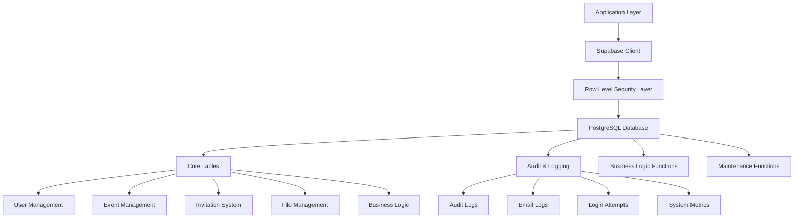
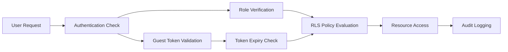

# Design Document

## Overview

This design document outlines the architecture for a comprehensive, secure, and performant Supabase migration for the Loventy platform. Based on analysis of the current migration files (20250718000010_reset_types_and_tables.sql, 20250718000011_constraints_indexes_policies_views.sql, 20250718000012_functions_triggers_seeds.sql, and security improvements), this migration will consolidate and optimize the existing database structure while maintaining full compatibility with the current application.

## Architecture

### Database Layer Architecture



### Security Architecture



## Components and Interfaces

### 1. Database Schema Components

#### Core ENUM Types
- **user_role_type**: Defines user roles (super_admin, admin, moderator, host, guest, support)
- **invitation_status_type**: Tracks invitation lifecycle (draft, published, sent, archived)
- **rsvp_status_type**: Guest response status (pending, confirmed, declined, maybe)
- **subscription_plan_enum**: Available plans (free, premium, pro, enterprise)
- **audit_action_enum**: System actions for logging
- **mfa_method_enum**: Multi-factor authentication methods

#### User Management Tables
- **profiles**: Extended user information with validation constraints
- **user_roles**: Role-based access control with expiration support
- **user_subscriptions**: Plan management with limits and features
- **user_sessions**: Session tracking with security metadata
- **user_mfa_settings**: Multi-factor authentication configuration

#### Event Management Tables
- **events**: Core event information with venue and timing details
- **event_collaborators**: Permission-based collaboration system
- **invitations**: Digital invitation instances with design settings
- **guests**: Guest management with secure access tokens
- **rsvp_questions**: Custom RSVP form questions
- **rsvp_answers**: Guest responses to custom questions

#### Content Management Tables
- **template_categories**: Organized template classification
- **invitation_templates**: Reusable design templates
- **user_files**: Secure file storage with metadata
- **invitation_media**: Media attachments for invitations

#### Business Logic Tables
- **plans**: Subscription plan definitions with Stripe integration
- **stripe_customers**: Customer relationship management
- **stripe_subscriptions**: Subscription lifecycle tracking

#### System Tables
- **audit_logs**: Comprehensive activity logging
- **email_logs**: Email delivery tracking
- **login_attempts**: Security monitoring
- **system_metrics**: Performance monitoring
- **system_alerts**: Automated alerting
- **seo_metadata**: SEO optimization support

### 2. Security Components

#### Row-Level Security (RLS) Policies
- **User-based policies**: Users can only access their own data
- **Role-based policies**: Admins have elevated access
- **Token-based policies**: Guests access via secure tokens
- **Public policies**: Public content accessible to all
- **Collaborative policies**: Shared access for event collaborators

#### Authentication Functions
- **has_user_role()**: Role verification with caching
- **has_role_permission()**: Permission-based access control
- **is_admin()**: Administrative privilege checking
- **get_user_role_cache()**: Optimized role retrieval

#### Security Validation
- **Email validation**: Regex-based email format checking
- **Phone validation**: International phone number validation
- **URL validation**: Secure URL format verification
- **Token generation**: Cryptographically secure token creation

### 3. Performance Components

#### Indexing Strategy
- **Primary indexes**: All primary keys and foreign keys
- **Composite indexes**: Multi-column indexes for common queries
- **Partial indexes**: Conditional indexes for filtered queries
- **Full-text indexes**: GIN indexes for search functionality
- **Unique indexes**: Constraint enforcement with performance benefits

#### Query Optimization
- **View materialization**: Pre-computed statistics and summaries
- **Function optimization**: SECURITY DEFINER functions for privilege escalation
- **Connection pooling**: Efficient database connection management
- **Query caching**: Optimized query execution plans

### 4. Business Logic Components

#### User Management Functions
- **handle_new_user_with_plan()**: Automated user onboarding
- **update_user_profile()**: Profile management with validation
- **get_user_profile()**: Secure profile retrieval
- **change_user_plan()**: Subscription management

#### Event Management Functions
- **create_event_with_invitation()**: Streamlined event creation
- **add_guest_to_invitation()**: Guest management with token generation
- **update_guest_rsvp()**: RSVP processing with validation
- **get_event_stats()**: Real-time event analytics

#### MFA Functions
- **setup_mfa_totp()**: TOTP configuration
- **verify_mfa_code()**: Multi-factor authentication verification
- **get_user_mfa_status()**: MFA status reporting

#### Session Management Functions
- **create_user_session()**: Session lifecycle management
- **get_user_active_sessions()**: Session monitoring
- **cleanup_expired_sessions()**: Automated maintenance

## Data Models

### User Profile Model
```sql
profiles {
  id: UUID (PK, FK to auth.users)
  email: TEXT (UNIQUE, NOT NULL, validated)
  first_name: TEXT
  last_name: TEXT
  avatar_url: TEXT
  phone: TEXT (validated)
  date_of_birth: DATE
  timezone: TEXT (default: UTC)
  language: TEXT (default: fr)
  is_active: BOOLEAN (default: true)
  email_verified: BOOLEAN (default: false)
  phone_verified: BOOLEAN (default: false)
  last_login_at: TIMESTAMPTZ
  created_at: TIMESTAMPTZ
  updated_at: TIMESTAMPTZ
}
```

### Event Model
```sql
events {
  id: UUID (PK)
  owner_id: UUID (FK to auth.users, NOT NULL)
  title: TEXT (NOT NULL)
  description: TEXT
  event_type: TEXT (default: wedding)
  event_date: DATE (NOT NULL)
  event_time: TIME
  venue_name: TEXT
  venue_address: TEXT
  venue_city: TEXT
  venue_country: TEXT (default: France)
  timezone: TEXT (default: Europe/Paris)
  max_guests: INTEGER (CHECK > 0)
  dress_code: TEXT
  gift_registry_url: TEXT (validated URL)
  special_instructions: TEXT
  is_public: BOOLEAN (default: false)
  slug: TEXT (UNIQUE, NOT NULL)
  created_at: TIMESTAMPTZ
  updated_at: TIMESTAMPTZ
}
```

### Guest Model
```sql
guests {
  id: UUID (PK)
  invitation_id: UUID (FK to invitations, NOT NULL)
  name: TEXT (NOT NULL)
  email: TEXT (validated)
  phone: TEXT (validated)
  status: rsvp_status_type (default: pending)
  response_message: TEXT
  dietary_restrictions: TEXT
  plus_one_allowed: BOOLEAN (default: false)
  plus_one_name: TEXT
  plus_one_email: TEXT (validated)
  access_token: TEXT (UNIQUE, secure)
  access_expires_at: TIMESTAMPTZ (default: +30 days)
  responded_at: TIMESTAMPTZ
  created_at: TIMESTAMPTZ
  updated_at: TIMESTAMPTZ
}
```

## Error Handling

### Database-Level Error Handling
- **Constraint violations**: Clear error messages for validation failures
- **Foreign key violations**: Referential integrity error reporting
- **Unique constraint violations**: Duplicate data prevention
- **Check constraint violations**: Business rule enforcement
- **RLS policy violations**: Security access denials

### Function-Level Error Handling
- **Authentication errors**: User not authenticated exceptions
- **Authorization errors**: Insufficient permission exceptions
- **Validation errors**: Data format and business rule violations
- **Resource not found**: Missing entity error handling
- **Rate limiting**: Excessive request prevention

### Application-Level Integration
- **Error codes**: Standardized error code system
- **Error messages**: User-friendly error descriptions
- **Logging**: Comprehensive error logging for debugging
- **Monitoring**: Error rate tracking and alerting

## Testing Strategy

### Unit Testing
- **Function testing**: Individual function validation
- **Constraint testing**: Database constraint verification
- **Policy testing**: RLS policy effectiveness
- **Trigger testing**: Automated trigger functionality

### Integration Testing
- **End-to-end workflows**: Complete user journey testing
- **Cross-table relationships**: Foreign key integrity testing
- **Performance testing**: Query performance validation
- **Security testing**: Access control verification

### Data Migration Testing
- **Schema validation**: Structure correctness verification
- **Data integrity**: Existing data preservation
- **Performance benchmarking**: Migration performance measurement
- **Rollback testing**: Migration reversal capability

### Security Testing
- **Penetration testing**: Security vulnerability assessment
- **Access control testing**: Permission boundary verification
- **Token security testing**: Authentication token validation
- **SQL injection testing**: Input sanitization verification

## Performance Considerations

### Query Optimization
- **Index utilization**: Optimal index usage for all queries
- **Query plan analysis**: Execution plan optimization
- **Connection pooling**: Efficient connection management
- **Prepared statements**: Query compilation optimization

### Scalability Design
- **Horizontal scaling**: Read replica support
- **Vertical scaling**: Resource utilization optimization
- **Caching strategy**: Query result caching
- **Pagination support**: Large dataset handling

### Monitoring and Metrics
- **Performance metrics**: Query execution time tracking
- **Resource utilization**: CPU, memory, and I/O monitoring
- **Connection monitoring**: Database connection tracking
- **Error rate monitoring**: System health assessment

## Security Considerations

### Data Protection
- **Encryption at rest**: Database-level encryption
- **Encryption in transit**: SSL/TLS communication
- **Data masking**: Sensitive data protection
- **Backup encryption**: Secure backup storage

### Access Control
- **Role-based access**: Hierarchical permission system
- **Token-based access**: Secure guest access tokens
- **Session management**: Secure session lifecycle
- **Multi-factor authentication**: Enhanced security options

### Audit and Compliance
- **Comprehensive logging**: All system actions logged
- **Data retention**: Configurable data retention policies
- **GDPR compliance**: Privacy regulation adherence
- **Security monitoring**: Real-time threat detection

## Deployment Strategy

### Migration Execution
- **Pre-migration validation**: Schema and data verification
- **Incremental deployment**: Staged migration approach
- **Rollback capability**: Safe migration reversal
- **Performance monitoring**: Migration impact assessment

### Post-Migration Validation
- **Data integrity checks**: Comprehensive data validation
- **Performance benchmarking**: System performance verification
- **Security validation**: Access control verification
- **Application compatibility**: Feature functionality testing