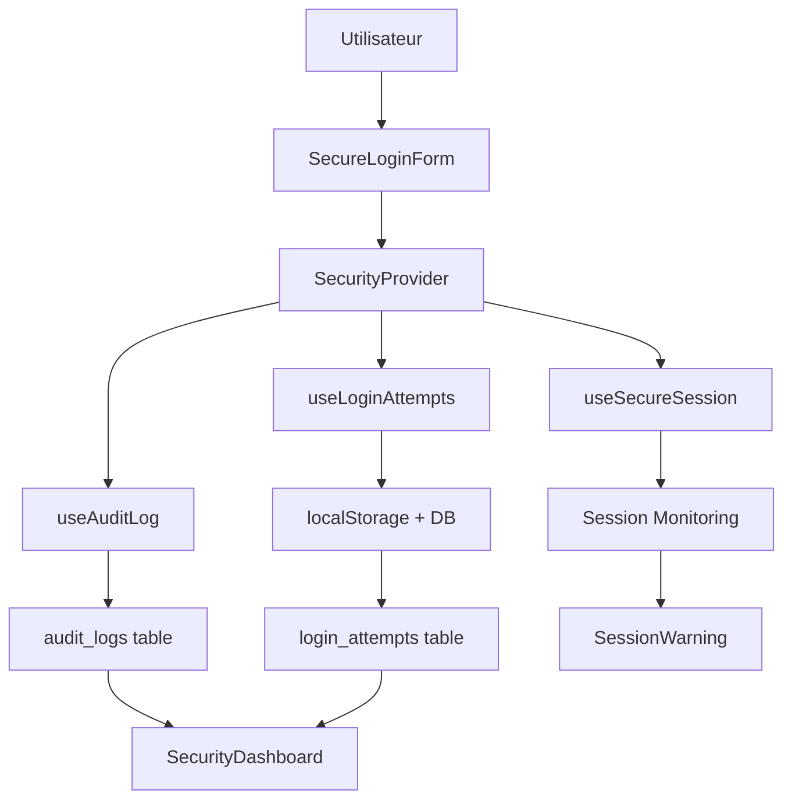

# Intégration Complète du Système de Sécurité - Loventy

## Vue d'ensemble

Ce document résume l'implémentation complète du système de sécurité avancé pour l'application Loventy. Le système comprend plusieurs couches de protection, d'audit et de surveillance.

## Composants Implémentés

### 1. Fournisseur de Sécurité (`SecurityProvider`)
- **Fichier**: `src/components/auth/SecurityProvider.tsx`
- **Fonctionnalités**:
  - Gestion centralisée de la sécurité
  - Session sécurisée avec détection d'inactivité
  - Protection contre les attaques par force brute
  - Système d'audit intégré
  - Avertissements de session automatiques

### 2. Formulaire de Connexion Sécurisé (`SecureLoginForm`)
- **Fichier**: `src/components/auth/SecureLoginForm.tsx`
- **Fonctionnalités**:
  - Validation en temps réel des champs
  - Protection contre les attaques par force brute
  - Verrouillage temporaire après échecs répétés
  - Audit des tentatives de connexion
  - Interface utilisateur informative sur la sécurité

### 3. Tableau de Bord de Sécurité (`SecurityDashboard`)
- **Fichier**: `src/components/admin/SecurityDashboard.tsx`
- **Fonctionnalités**:
  - Vue d'ensemble des métriques de sécurité
  - Logs d'audit en temps réel
  - Surveillance des tentatives de connexion
  - Détection d'activités suspectes
  - Export des logs de sécurité
  - Filtrage et recherche avancés

### 4. Hooks de Sécurité

#### `useSecureSession`
- **Fichier**: `src/hooks/useSecureSession.ts`
- **Fonctionnalités**:
  - Détection d'inactivité utilisateur
  - Validation automatique des sessions
  - Renouvellement des tokens
  - Audit des actions utilisateur

#### `useLoginAttempts`
- **Fichier**: `src/hooks/useLoginAttempts.ts`
- **Fonctionnalités**:
  - Suivi des tentatives de connexion (côté client)
  - Verrouillage temporaire
  - Fenêtre glissante pour les tentatives
  - Formatage du temps restant

### 5. Composants d'Interface

#### `SessionWarning`
- **Fichier**: `src/components/auth/SessionWarning.tsx`
- **Fonctionnalités**:
  - Avertissement avant expiration de session
  - Options d'extension ou de déconnexion
  - Interface non-intrusive

#### `ValidatedInput`
- **Fichier**: `src/components/forms/ValidatedInput.tsx`
- **Fonctionnalités**:
  - Validation en temps réel
  - Feedback visuel immédiat
  - Messages d'erreur contextuels

### 6. Base de Données

#### Migration de Sécurité
- **Fichier**: `supabase/migrations/20250118000001_add_login_attempts_table.sql`
- **Fonctionnalités**:
  - Table `login_attempts` pour le suivi serveur
  - Fonctions de sécurité automatisées
  - Détection de patterns suspects
  - Nettoyage automatique des anciennes données

#### Tables Principales
- `audit_logs`: Journalisation complète des actions
- `login_attempts`: Suivi des tentatives de connexion
- `mfa_settings`: Configuration de l'authentification multi-facteurs
- `session_activities`: Activités de session

## Architecture de Sécurité

### Couches de Protection

1. **Couche Client**:
   - Validation des formulaires
   - Verrouillage temporaire local
   - Détection d'inactivité
   - Chiffrement des communications

2. **Couche Serveur**:
   - Row-Level Security (RLS)
   - Audit automatique
   - Détection de patterns suspects
   - Limitation de taux

3. **Couche Base de Données**:
   - Politiques RLS strictes
   - Fonctions de sécurité
   - Index optimisés
   - Nettoyage automatique

### Flux de Sécurité



## Configuration et Utilisation

### 1. Intégration dans l'Application

Le `SecurityProvider` est intégré au niveau racine dans `main.tsx`:

```tsx
<AuthProvider>
  <SecurityProvider>
    <App />
  </SecurityProvider>
</AuthProvider>
```

### 2. Configuration des Paramètres

```tsx
<SecurityProvider
  sessionConfig={{
    inactivityTimeout: 30 * 60 * 1000, // 30 minutes
    warningTime: 5 * 60 * 1000,        // 5 minutes
    checkInterval: 60 * 1000           // 1 minute
  }}
  loginAttemptsConfig={{
    maxAttempts: 5,                    // 5 tentatives max
    lockoutDuration: 15 * 60 * 1000,   // 15 minutes
    slidingWindow: 60 * 60 * 1000      // 1 heure
  }}
>
```

### 3. Utilisation dans les Composants

```tsx
const { 
  isLocked, 
  remainingAttempts, 
  recordLoginAttempt, 
  logAction 
} = useSecurity();
```

## Fonctionnalités de Sécurité

### 1. Protection contre la Force Brute
- Limitation des tentatives de connexion
- Verrouillage temporaire progressif
- Suivi par email et IP
- Détection de patterns suspects

### 2. Gestion de Session Sécurisée
- Détection d'inactivité automatique
- Avertissements avant expiration
- Validation continue des tokens
- Renouvellement automatique

### 3. Audit Complet
- Journalisation de toutes les actions
- Métadonnées détaillées
- Niveaux de sévérité
- Recherche et filtrage

### 4. Interface d'Administration
- Tableau de bord en temps réel
- Métriques de sécurité
- Gestion des alertes
- Export des données

## Métriques et Surveillance

### Métriques Clés
- Nombre total de connexions
- Taux d'échec de connexion
- IPs bloquées
- Sessions actives
- Activités suspectes

### Alertes Automatiques
- Tentatives de connexion multiples
- Patterns d'attaque détectés
- Sessions expirées
- Erreurs système

## Tests et Validation

### Composant de Test
- **Fichier**: `src/components/debug/SecurityTest.tsx`
- **Fonctionnalités**:
  - Tests d'intégration automatisés
  - Validation des fonctionnalités
  - Rapport de statut détaillé
  - Interface de débogage

### Tests Inclus
1. Disponibilité du SecurityProvider
2. État de la session sécurisée
3. Protection contre force brute
4. Système d'audit
5. Enregistrement des tentatives
6. Authentification utilisateur
7. Extension de session

## Sécurité et Conformité

### Standards Respectés
- OWASP Top 10 protection
- GDPR compliance (audit logs)
- Chiffrement des communications
- Validation côté client et serveur

### Bonnes Pratiques
- Principe du moindre privilège
- Défense en profondeur
- Audit trail complet
- Gestion d'erreurs sécurisée

## Maintenance et Évolution

### Tâches de Maintenance
- Nettoyage automatique des logs anciens
- Mise à jour des règles de sécurité
- Surveillance des performances
- Révision des politiques RLS

### Évolutions Futures
- Authentification multi-facteurs (MFA)
- Détection d'anomalies par IA
- Intégration SIEM
- Notifications en temps réel

## Conclusion

Le système de sécurité implémenté fournit une protection complète et multicouche pour l'application Loventy. Il combine des mesures préventives, détectives et correctives pour assurer la sécurité des utilisateurs et des données.

L'architecture modulaire permet une maintenance facile et des évolutions futures, tout en respectant les meilleures pratiques de sécurité web moderne.